# CMPE272: Enterprise Software Platforms

#### Assignment 2: Building serverless application
#### Author: Kenil G Gopani
#### SJSU ID: 017992624
#### Guidance by: Prof. Rakesh Ranjan

## Tech Stack

**Backend:** AWS lamda

**Database:** DynamoDB

## Steps

### Setting Up the DynamoDB Table
1. Go to the AWS Management Console and navigate to DynamoDB.
2. Create a new table:
   - Table Name: StudentRecords
   - Primary Key: student_id (String)
3. After the table is created, note down the table name.
   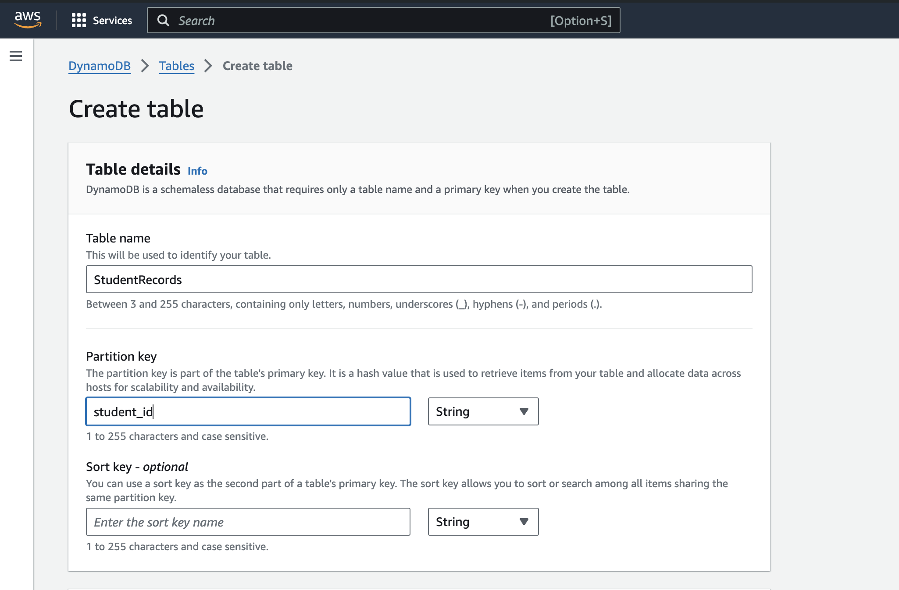

### Configuring IAM Role for AWS Lambda and DynamoDB
#### To allow the Lambda function to interact with DynamoDB, I created a new IAM role with the necessary permissions:

1. Created a New IAM Role: I navigated to the IAM management console and created a new role specifically for the Lambda service.
2. Assigned DynamoDB Permissions: I attached the "AmazonDynamoDBFullAccess" policy to the role to ensure the Lambda function can perform CRUD operations on the DynamoDB table.
3. Attached the Role to Lambda: After creating the role, I linked it to my Lambda function, allowing it to execute with the necessary permissions to access DynamoDB.

   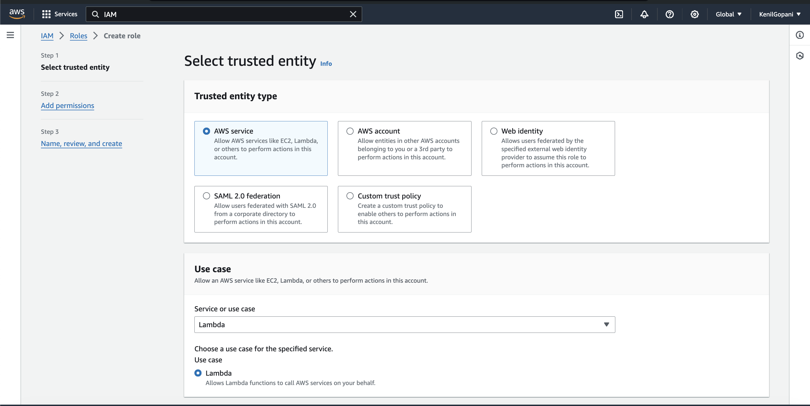
   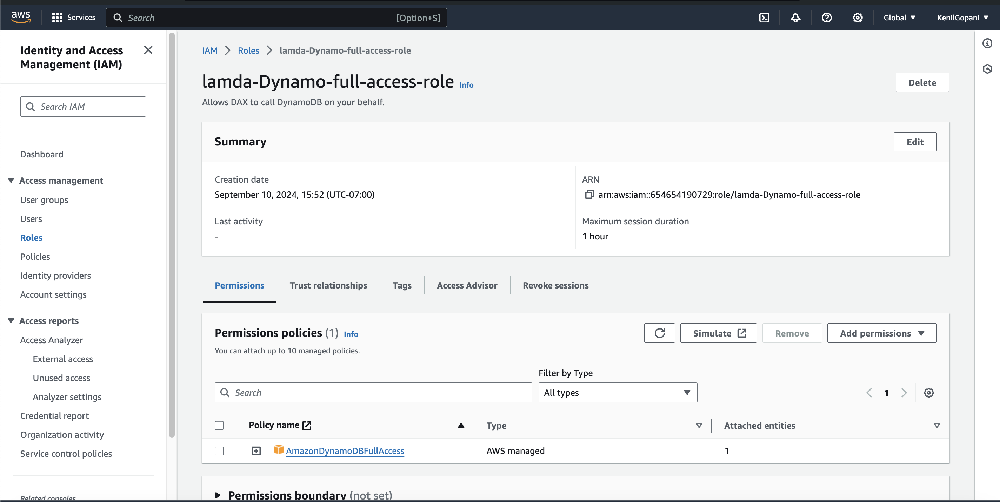

### Creating an AWS Lambda Function
1. Navigate to AWS Lambda in the AWS Management Console.
2. Create a new Lambda function:
   - Function Name: StudentRecordHandler
   - Runtime: Choose Python 3.x or Node.js (depending on your preferred language).
   - Permissions: Attach the appropriate role to allow Lambda to read/write to DynamoDB.
3. Inside your Lambda function, write code to handle basic CRUD operations with DynamoDB.
   - Create: Insert a new student record into the DynamoDB table.
   - Read: Fetch a student record by student_id.
   - Update: Update a student's details.
   - Delete: Remove a student record.
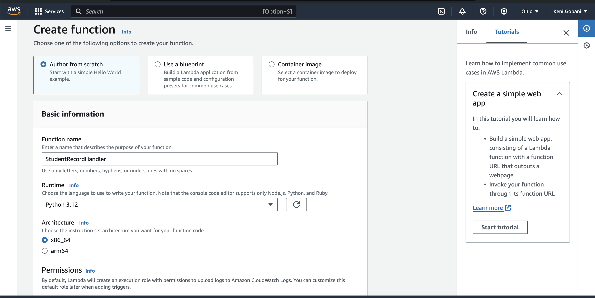
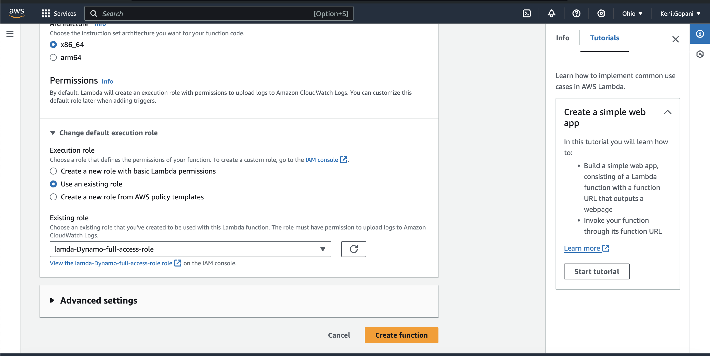

### Python Example Code (for basic CRUD operations):
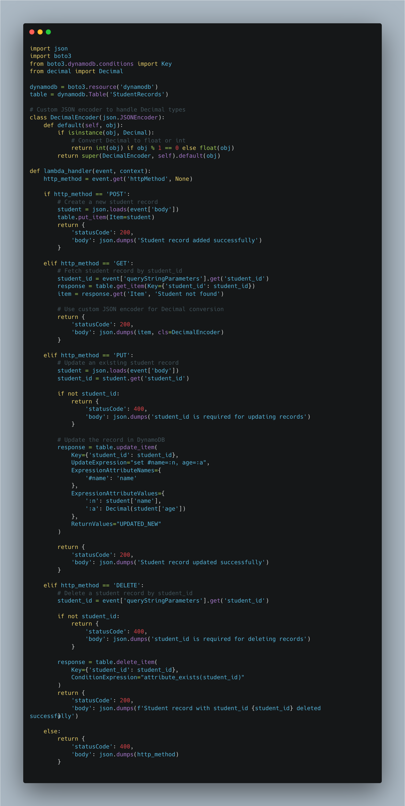

### Creating an API Gateway
1. Go to API Gateway in the AWS Management Console.
2. Create a new REST API:
   - API Name: StudentAPI
3. Set up the following resources and methods:
   - POST /students: Trigger the Lambda function to add a new student.
   - GET /students: Trigger the Lambda function to retrieve student details by student_id.
4. Deploy the API and note down the Invoke URL.

### Testing the Application
1. Use Postman or curl to test the API by sending HTTP requests to the deployed API Gateway.
   - **POST Request**: https://n04iwlh2ma.execute-api.us-east-amazonaws.com/dev/StudentRecordHandler/students
     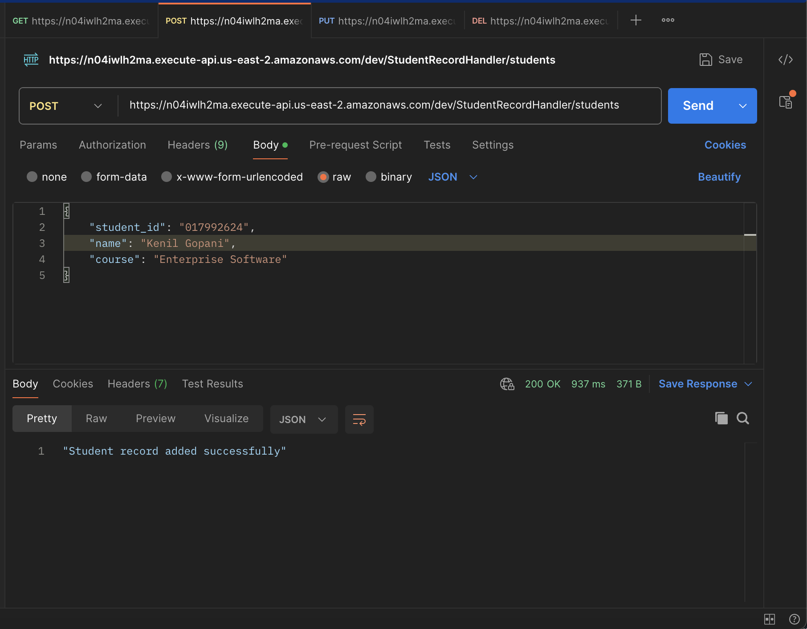
     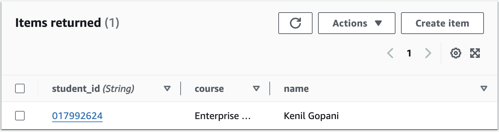

      
   - **GET Request**: https://n04iwlh2ma.execute-api.us-east-2.amazonaws.com/dev/StudentRecordHandler/students?student_id=017992624
     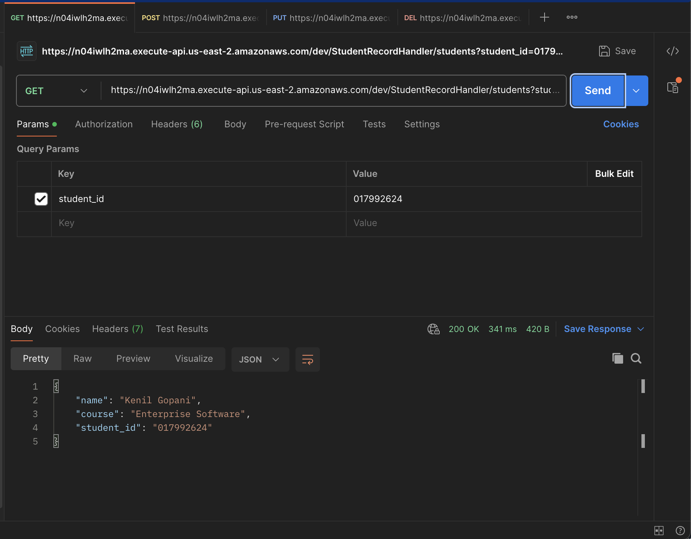

     Let’s add some more records:
     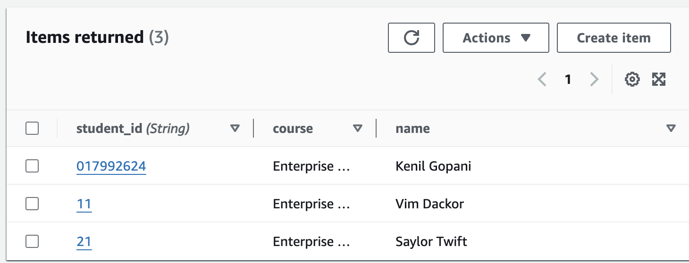

       
   - **PUT Request**: https://n04iwlh2ma.execute-api.us-east-2.amazonaws.com/dev/StudentRecordHandler/students
     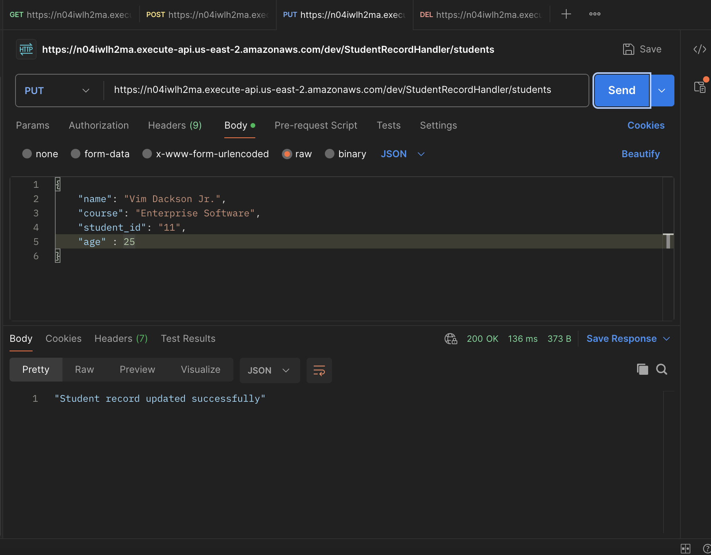
     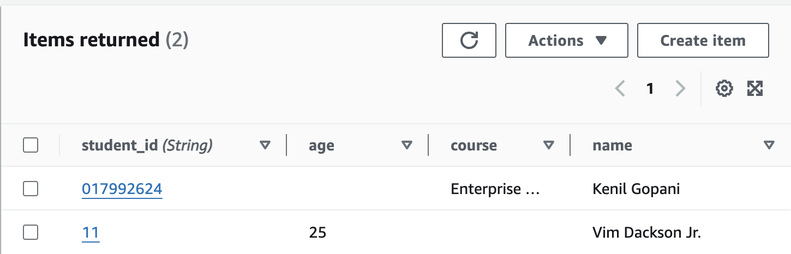

       
   - **DELETE Request**: https://n04iwlh2ma.execute-api.us-east-2.amazonaws.com/dev/StudentRecordHandler/students?student_id=21
     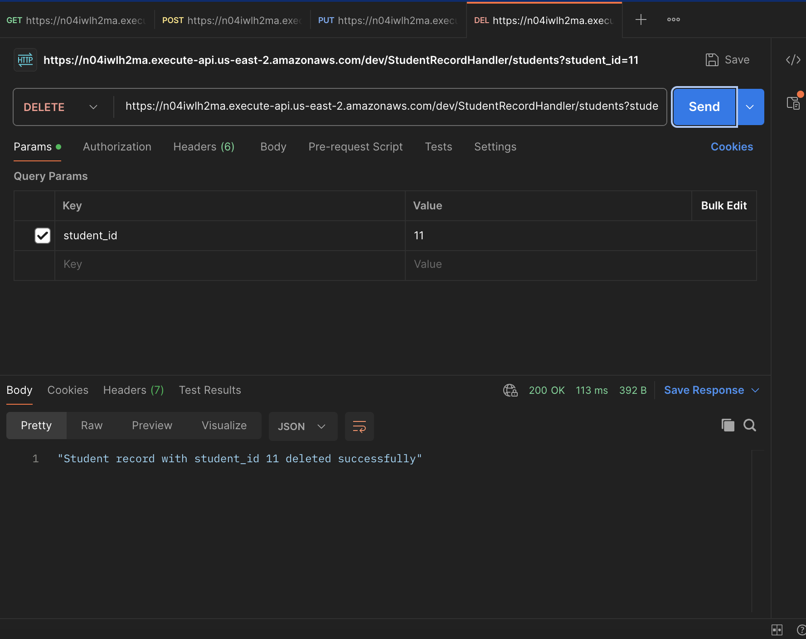
     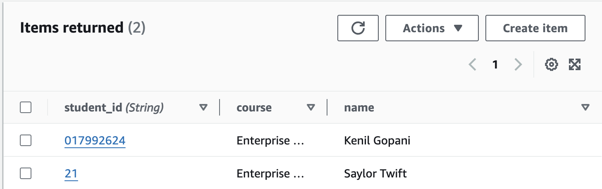

### Reflection :
- Working with AWS Lambda provided me with insights into how it differs significantly from traditional services like AWS EC2. Unlike EC2, which requires manual scaling and continuous operation, Lambda is auto-scalable and event-driven. It executes code only when invoked and then returns to an idle state, making it highly efficient for on-demand opera\ons.
- I learned how Lambda can be leveraged for various backend tasks such as notification broadcasting, image compression, and more, making it a versatile tool. Its cost- effectiveness especially for tasks with intermi1ent workloads. However, I also recognized some limita\ons, such as cold start delays and a limited execution time for long-running tasks, which need to be considered depending on the use case.
- Another interesting aspect was DynamoDB’s integration with AWS Lambda. This integration made it easier to build a fully serverless application, allowing me to quickly read and write data without managing any infrastructure.
